# Käännöstyö

Tämä alkuteksti on Markdown-formaattia jonka syntaksi ohje löytyy [täältä](https://docs.github.com/en/get-started/writing-on-github/getting-started-with-writing-and-formatting-on-github/basic-writing-and-formatting-syntax).

## Pika-opas GitHub:iin

Käyttöä voi helpottaa GitHubin [sovellus](https://desktop.github.com/). Käyttää voi myös "git" komentorivi työkalulla.
Kuitenkin käytön pitäisi onnistua hyvin suoraa selaimesta.

### Luo tai lisää tiedosto
Kansioiden luonti onnistuu luodessa tiedostoa lisäämällä "/" tiedostonimeen.
Tiedostoa luodessa sen voi joko päivittää suoraa yhteiseen "branch"iin tai luoda uusi "branch" muokkaukselle. Näistä kohta lisää
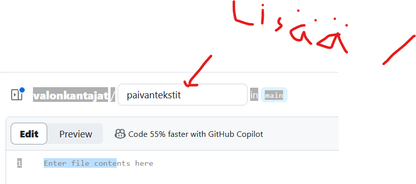
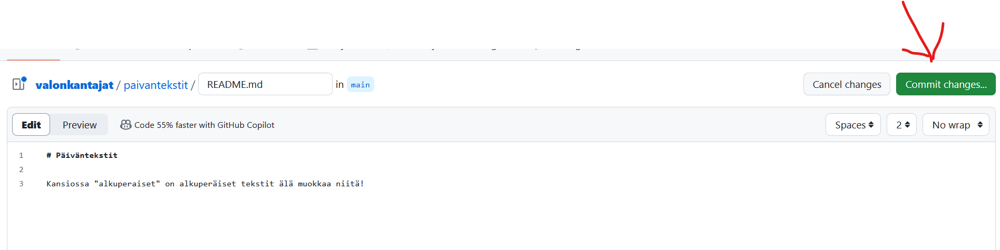
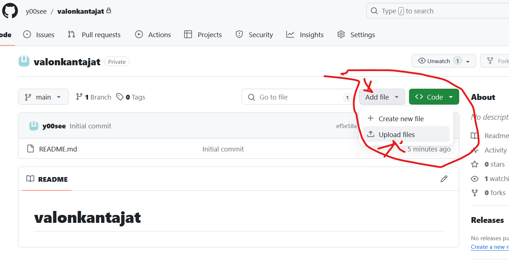
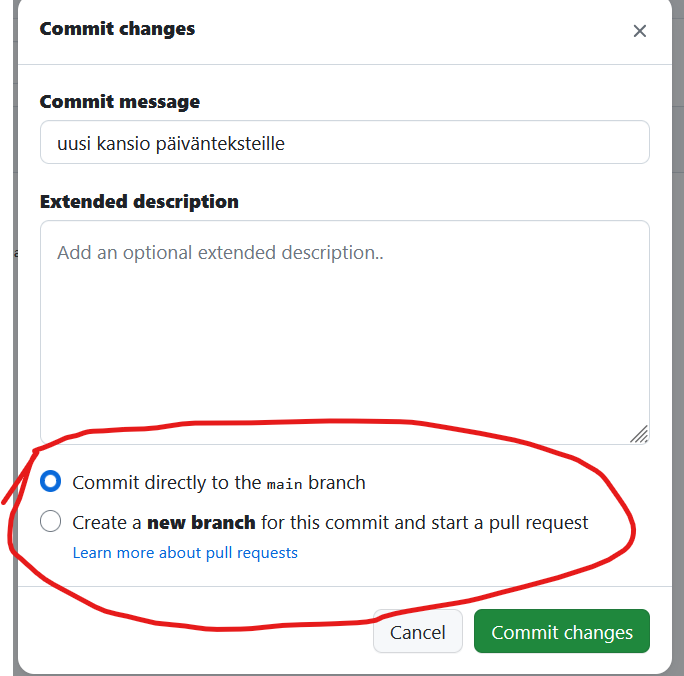

### Muokkaa tekstiä

Tiedostoja voi muokata suoraa selaimessa. Muokkaus historiaa voi selata helposti ja nähdä mitä muokattiin.

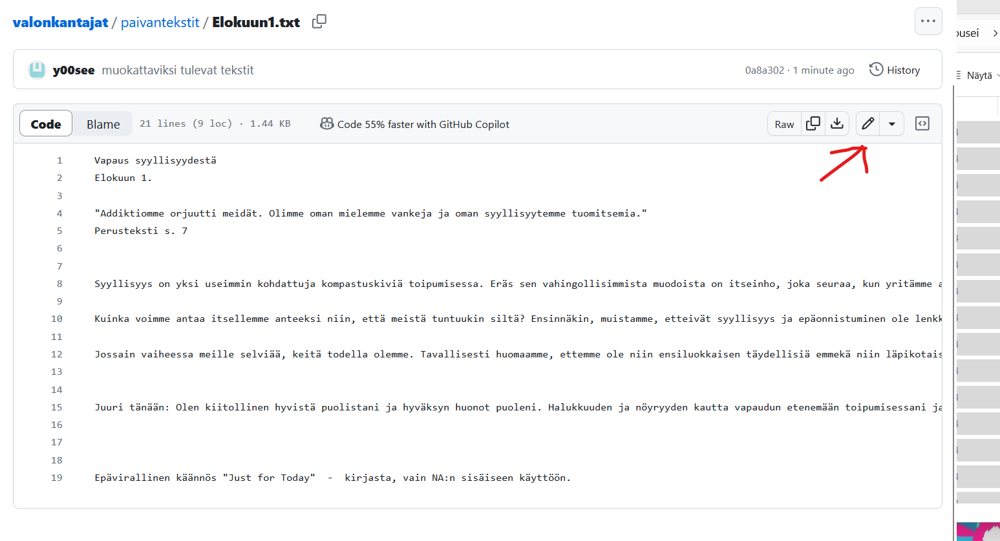
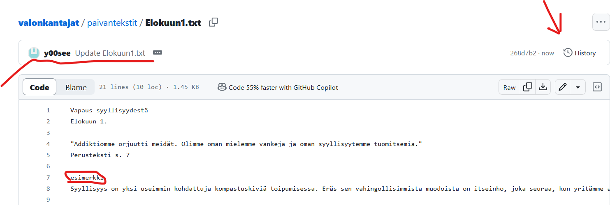
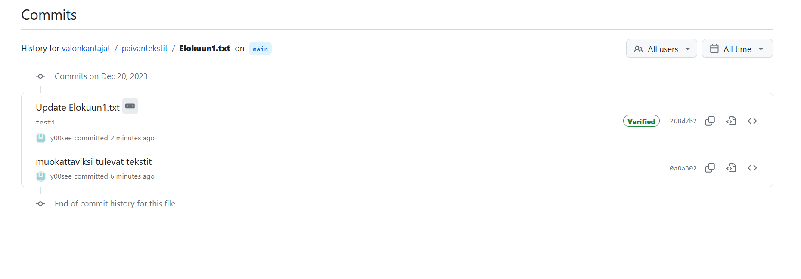
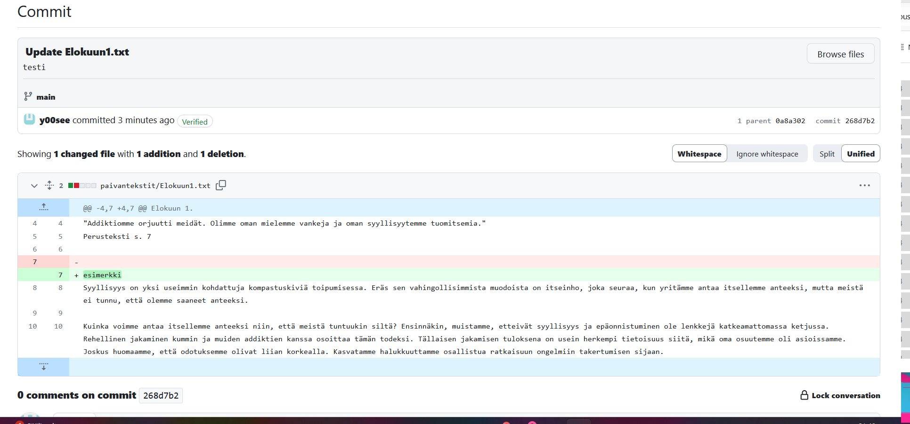

### Branchit

Sen sijaan että muokattaisiin suoraa kaikkien yhteisiä tiedostoja niin järkevää olisi tehdä oma erillinen versio tai kopio jossa voi rauhassa muokata tiedostoja ja sitten lopulta yhdistää ne "main branch"iin pyytämällä muita hyväksymään muokkaukset.

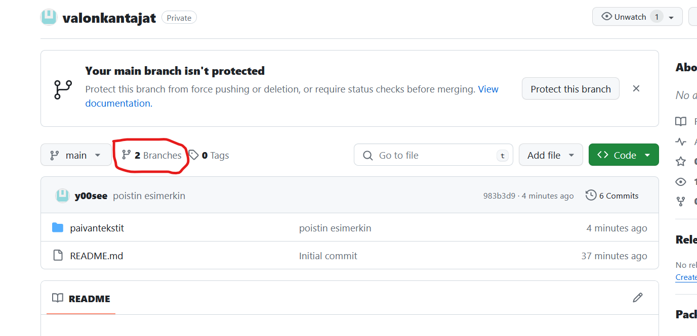
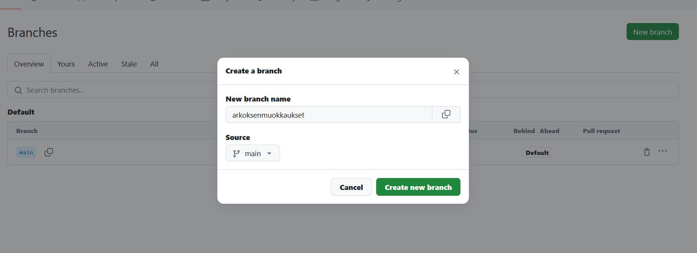
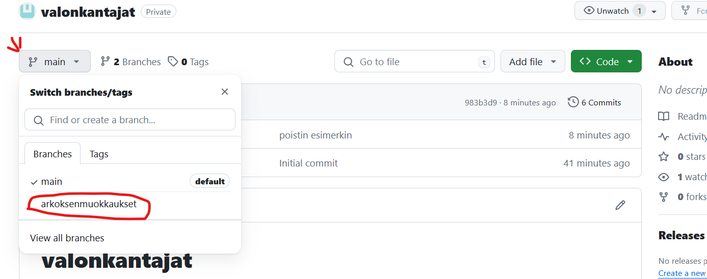
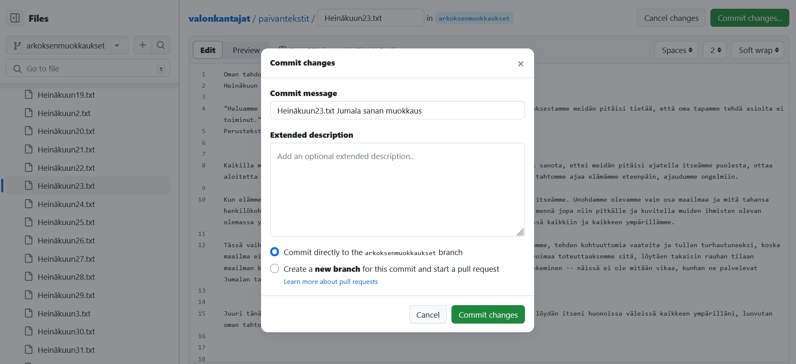
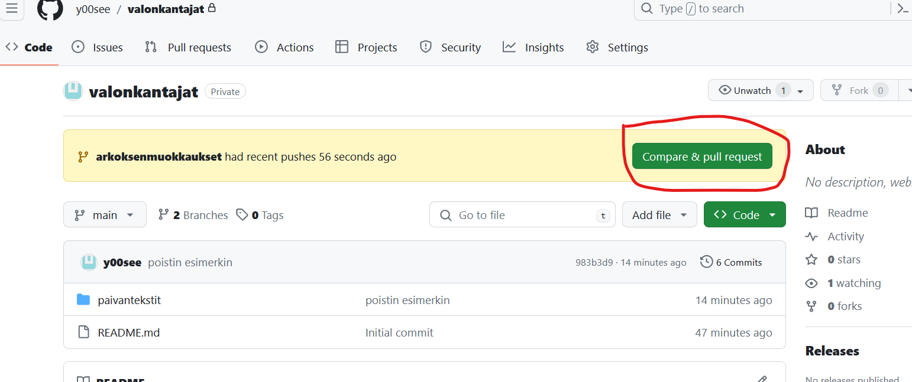
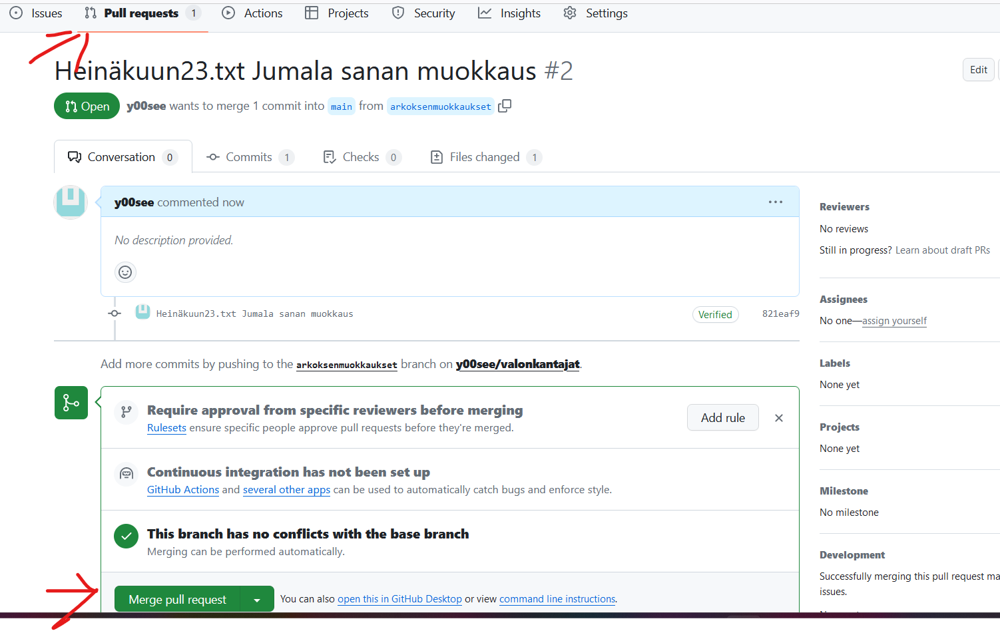
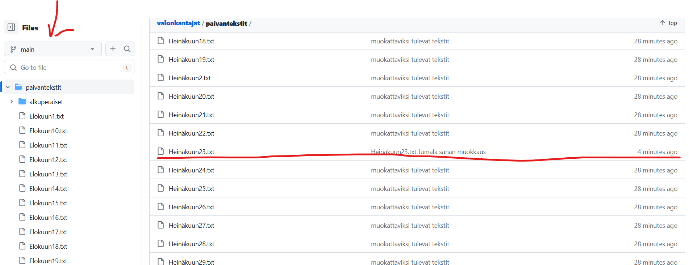
